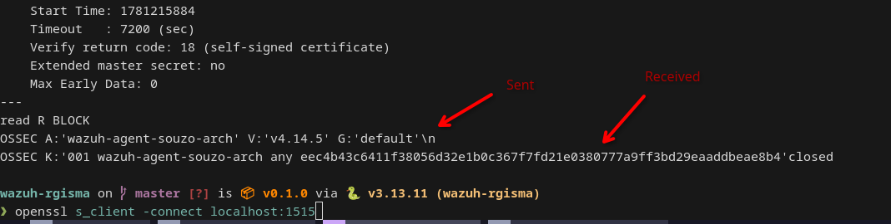
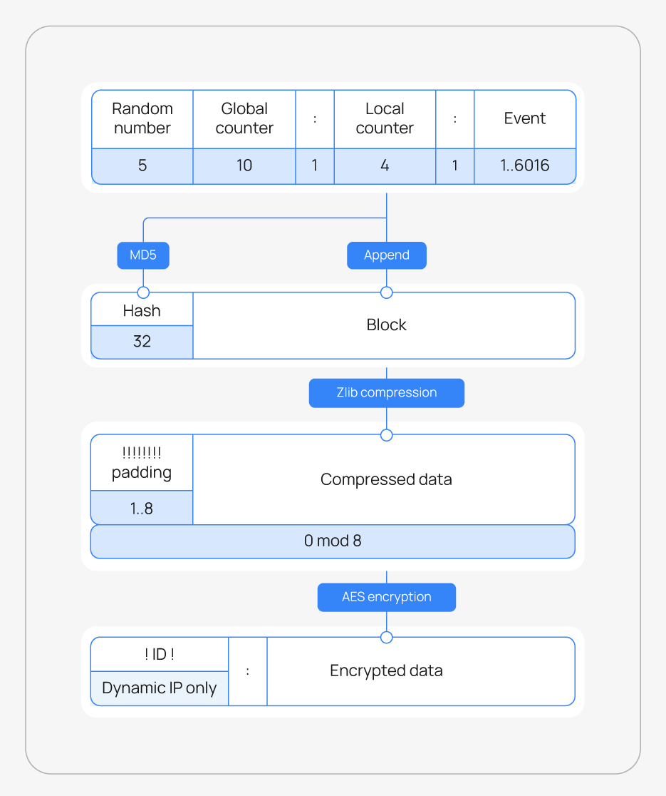

# Making a wazuh server in python from scratch for fun and maybe profit

Hi, souzo here, today I will show you how I created a wazuh server from scratch analysing wazuh agent request and wazuh server response.

I don't see anyone doing this or trying to replicate the wazuh server protocol, then I made this.

# Let's analyze

## Agent register enrollment - 1515

I created an server with SSL on 1515 to receive the agent connection, then I received this.


This is the first wazuh agent connection made and got this request.

```
OSSEC A:'wazuh-agent-souzo-arch' V:'v4.14.5' G:'default'\n
```

This is what I think about the message received from agent
- *OSSEC* maybe is the message ID
- *A:* Looks like the agent name
- *V:* Looks the wazuh agent version
- *G:* Looks the group
- *\n* It's while the message finish

Before this, let's send this message to wazuh server and see what they will send back



```
OSSEC K:'001 wazuh-agent-souzo-arch any eec4b43c6411f38056d32e1b0c367f7fd21e0380777a9ff3bd29eaaddbeae8b4'closed
```

Let's analyze the message:
- *OSSEC* Again the message id
- *K:* This is the registration response
    - *001*: the agent ID
    - *wazuh-agent-souzo-arch*: The agent name
    - *any*: I don't know
    - *eec4b43c6411f38056d32e1b0c367f7fd21e0380777a9ff3bd29eaaddbeae8b4*: Maybe It's the connection password

The connection has closed before receive this, then I can presume this is the final and it will going to connect on 1514 using the connection password

## Agent connection - 1514

Let's analyze what the agent connection on 1514 do.

Since now we can handle wazuh agent registration, ...

### Wazuh network package

Following the wazuh message format, we can get a lot of interesting information without needing to read the code.



This image from wazuh talk exactly why we need to do.

1. Get package lenght

Wazuh agent send in the first 4 bytes the package lenght.

2. Decrypt AES

First of all, take a look in the AES IV of the agent. [AES IV](https://github.com/wazuh/wazuh/blob/v4.14.6/src/os_crypto/aes/aes_op.c#L26)

This hardcoded "iv", allow wazuh agent to encrypt their communication with any wazuh server over the interenet.

```c
static unsigned char *iv = (unsigned char *)"FEDCBA0987654321";
```

Before received all package, we can get the agent "Id" and the encrypted AES data.

With the agent ID we can retreive the "Agent Key" from the database.

The agent key is not the AES key, but the MD5 of the agent key.

3. Padding + Compressed Data

Before decrypt the AES package, we can see the padding and the rest is the compressed data.

Let's remove all "!" of the message and decompress with zlib.

4. 

Let's send the same response we get from server to wazuh agent, and see what they will send on 1514.


