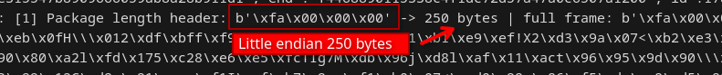
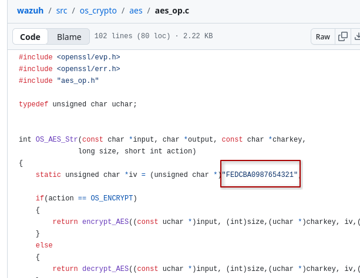
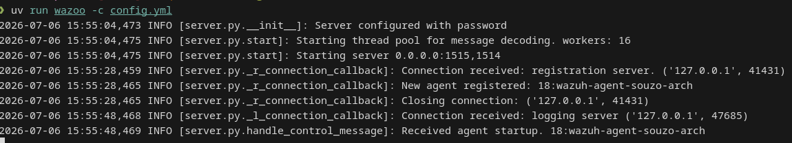

# Making a wazuh server in python from scratch for fun and maybe profit

Hi, souzo here, today I will show you how I created a wazuh server from scratch analysing wazuh agent request and wazuh server response.

I don't see anyone doing this or trying to replicate the wazuh server protocol, then I made this.

# Let's analyze

## Agent register enrollment - 1515

I created an server with SSL on 1515 to receive the agent connection, then I received this.


This is the first wazuh agent connection made and got this request.

```
OSSEC A:'wazuh-agent-souzo-arch' V:'v4.14.5' G:'default'\n
```

This is what I think about the message received from agent
- *OSSEC* maybe is the message ID
- *A:* Looks like the agent name
- *V:* Looks the wazuh agent version
- *G:* Looks the group
- *\n* It's while the message finish

Before this, let's send this message to wazuh server and see what they will send back


```
OSSEC K:'001 wazuh-agent-souzo-arch any eec4b43c6411f38056d32e1b0c367f7fd21e0380777a9ff3bd29eaaddbeae8b4'closed
```

Let's analyze the message:
- *OSSEC* Again the message id
- *K:* This is the registration response
    - *001*: the agent ID
    - *wazuh-agent-souzo-arch*: The agent name
    - *any*: I don't know
    - *eec4b43c6411f38056d32e1b0c367f7fd21e0380777a9ff3bd29eaaddbeae8b4*: Maybe It's the connection password

The connection has closed before receive this, then I can presume this is the final and it will going to connect on 1514 using the connection password

## Agent connection - 1514

Let's analyze what the agent connection on 1514 do.

Since now we can handle wazuh agent registration, ...

### Wazuh network package

Following the wazuh message format, we can get a lot of interesting information without needing to read the code.


This image from wazuh talk exactly why we need to do.

1. Get package length

Wazuh agent send in the first 4 bytes the package length.



2. Decrypt AES

First of all, take a look in the AES IV of the agent. [AES IV](https://github.com/wazuh/wazuh/blob/v4.14.6/src/os_crypto/aes/aes_op.c#L26)

This hardcoded "iv", allow wazuh agent to encrypt their communication with any wazuh server over the internet.

```c
static unsigned char *iv = (unsigned char *)"FEDCBA0987654321";
```



Before decrypting, we need two things out of the package: **who** sent it and
**what** to decrypt. The agent frames every message like this:

```
!<agent id>!#AES:<encrypted data>
```

So we scan for the two `!` markers to pull the agent id, then everything after
the `#AES:` tag is the ciphertext:

```python
def parseMessageHeader(msg: bytes) -> tuple[int, bytes]:
    """Parse `!<id>!#AES:<data>` in a single pass, returning (agent_id, aes_data)."""
    _start = msg.find(b"!")
    _end = msg.find(b"!", _start + 1)
    agent_id = int(msg[_start + 1 : _end])
    aes_data = msg[_end + 1 + _aes_id_len :]  # _aes_id_len == len(b"#AES:")
    return agent_id, aes_data
```

With the agent id we look up the "Agent Key" we saved back during the `1515`
enrollment. But that key is **not** the AES key directly. Wazuh derives the AES
key by taking the MD5 of the agent key, and — this is the part that trips
everyone up — it uses the **hex digest string** (32 ASCII chars), not the raw 16
MD5 bytes. That 32 byte string is exactly an AES-256 key:

```python
@cached_property
def aes_key(self) -> bytes:
    return hashlib.md5(self.key).hexdigest().encode()  # 32 chars -> AES-256 key
```

Now we have everything: the ciphertext, the key, the mode (CBC) and the
hardcoded IV. Decrypting is just one call:

```python
hardcoded_wazuh_iv = b"FEDCBA0987654321"

def _decode(agent: WazuhAgent, msg: bytes) -> bytes:
    cipher = AES.new(agent.aes_key, AES.MODE_CBC, iv=hardcoded_wazuh_iv)
    return cipher.decrypt(msg)
```

If the key is right, the bytes that come out are the `!` padding followed by the
zlib compressed body. If the key is wrong, we get garbage that fails to
decompress — a nice cheap way to reject a bad agent before doing any more work.

3. Padding + Compressed Data

Before decrypt the AES package, we can see the padding and the rest is the compressed data.

Let's remove all "!" of the message and decompress with zlib.


4. Read the decoded message

After decompressing, we finally get the plain message. It is not just the
event, it has a small header glued in front of it:

```
<md5 checksum (32 bytes)><rand+global (15 bytes)>:<local (4 bytes)>:<event>
```


- **checksum**: the first 32 bytes are the MD5 of everything after it (the
  "body"). If our own MD5 of the body matches this value, the message is valid
  and was encrypted with the right key. If it doesn't match, we probably have
  the wrong agent key, so we drop the connection.
- **rand + global**: 5 random bytes followed by a 10 digit global counter.
- **local**: a 4 digit per-agent counter.
- **event**: everything else. This is the part we actually care about.

In code this is exactly the `DecodedMessage` parser: split the body on `:` and
validate `md5(body) == checksum`.

## Control messages vs logs

Now that we can read the event, we notice there are two kinds of messages.

If the event starts with `#!-` (Wazuh calls it the "start header"), it is a
**control message**, not a log. Following the
[rc.h](https://github.com/wazuh/wazuh/blob/v4.14.5/src/headers/rc.h) header we
can map them:

```
#!-agent startup    -> the agent just came online
#!-agent shutdown   -> the agent is going offline
#!-agent ack        -> acknowledgement (this is what the server answers)
```


Anything that does **not** start with `#!-` is a real event coming from the
agent's logcollector (a log line, a FIM event, syscollector data, etc). Those
are the messages we want to forward somewhere useful.


So the server logic is simple:

- got a control message? answer with an `ACK` so the agent knows we are alive.
- got a log? forward the event and keep reading.

## Answering the agent (the ACK)

To reply we just do the whole encryption flow backwards. Given the event we want
to send (for a keepalive that is `#!-agent ack `), we:

1. build the body `md5(msg) + msg`
2. compress it with zlib
3. pad it with `!` bytes until the length is a multiple of the AES block size
4. AES-CBC encrypt it with the same hardcoded IV and the agent key
5. prefix it with `#AES:`
6. and finally prepend the 4 byte little-endian length frame, the same framing
   the agent used with us

That is precisely what `WazuhHelper.encodeSecMessage` does. Once the agent
receives our `ACK`, the handshake is complete and it keeps sending its logs and
periodic keepalives over the same 1514 connection.

## Putting it all together

The full life of an agent, from the server point of view, looks like this:

```
agent  --( OSSEC A:'...' V:'...' )-->  server        (1515, over TLS)
agent  <--( OSSEC K:'001 ...' )--------  server        register + client.keys
agent  --( #!-agent startup  )-------->  server        (1514)
agent  <--( #!-agent ack  )------------  server        ACK
agent  --( log event )--------------->  server        forwarded to a sink
agent  <--( #!-agent ack  )------------  server        keepalive loop...
```

And that is it. By only looking at the bytes on the wire and the few public
Wazuh headers, we replicated enough of the manager protocol to enroll agents,
decrypt their messages and answer them, without running the real Wazuh server.

# Profit

I turned all of this into a small library called **wazoo**, so you can run your
own drop-in Wazuh manager in a few lines of Python.



Check the repo at
[github.com/souzomain/wazoo](https://github.com/souzomain/wazoo) to spin up your
own server, forward the decoded events over TCP/UDP/Unix/file, and enroll real
Wazuh agents against it.

Thanks for reading!

— souzo
